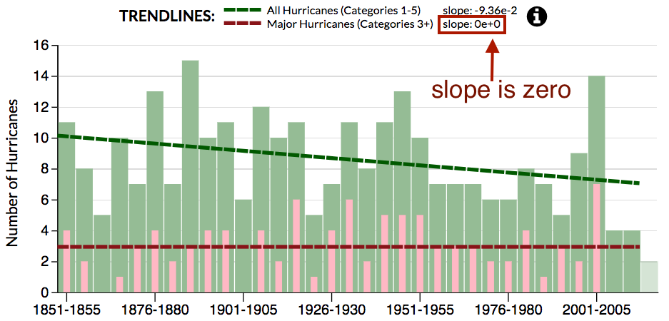
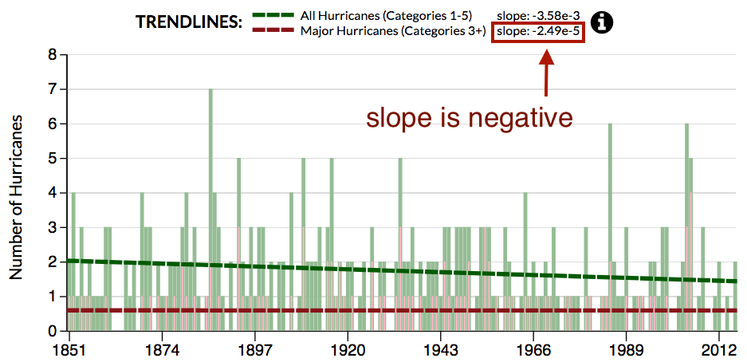
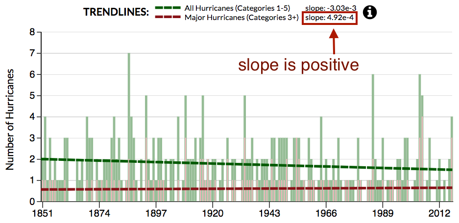

# Number of Hurricanes in America Over Time
* [Live link][live-link]

## Background

After The Economist [published an article][economist-link] headlined "Hurricanes in America have become less frequent" along with a chart, the blog [Storytelling With Data][storytelling-with-data-link] presented the interesting challenge of how one would portray the data differently.

[My interactive visualization][live-link] is less how I'd choose to portray the data and more of a exploratory tool to examine the ways in which The Economist's visualization potentially fell short. It's more of a first step toward deciding what could be a better visualization.

## Analysis of The Economist's Data Viz

The Economist's aforementioned chart is below:

</img>

Looking over the chart and [the article that accompanied it][economist-link], I had a few observations:
* The chart is positioned next to the sentence "Climate models predict that man-made global warming will not lead to a greater number of tropical cyclones overall, but will make those that do occur more intense."

* As such, the chart is supposed to be visual rhetoric: its point is to demonstrate that while hurricanes (at least the ones impacting America) have become less frequent over time, major hurricanes have become more frequent. If that's the intended purpose, how does the chart fare in achieving it?

#### Positives
* ###### The chart is compact.
  * By setting the intervals of the time series to decades, many years' worth of data can be packed into a small space.
  * This makes the chart easier to print in a publication with limited space.
  * It also makes it easier for a reader to consider the data.
* ###### The trendlines stand out.
  * They convey through contrasting slopes that while hurricanes as a whole have decreased over time, the number of major hurricanes has gone up slightly.
  * I think it's worth considering why the trendlines aren't just shown on their own, without the bars. My guess? Readers could get confused and think that the trendlines -- rather than being linear best-fit lines -- correspond to actual hurricane figures over time. The bars help prevent that misunderstanding.
* ###### The colors make sense.
  * Major hurricanes vary in shading but are all reddish to indicate that they are more serious. More minor hurricanes are shaded turquoise/teal.
  * The breakdown of the categories is mostly clear because the shadings are sufficiently different from each other (but perhaps not to the color blind, so accessibility could be a concern).
* ###### The bars for major hurricanes are positioned relative to the baseline.
  * The trendline for the major hurricanes makes much more sense to the viewer when the bars are at the baseline. Otherwise, it'd be difficult to see how the bars comport with their trendline.

#### Negatives
* ###### The stacked barchart somewhat distracts from comparing major hurricanes to all hurricanes.
  * It's cool to be able to see the breakdown of the hurricanes by category within each time interval, but if the main goal is to compare major hurricanes with all hurricanes, perhaps it'd be better to just show those two categories. And to have the bars representing major hurricanes appear _within_ the bars representing all hurricanes, so there's no confusion about their relationship.
* ###### It could be made clearer that 2011-2016 isn't being included in trendline calculations.
  * As the chart stands now, the trendlines appear to intentionally stop before the last bar to show that they don't include the data from the last bar. But I think graying out or changing the opacity of the last bar (or just including a little annotation) would drive home that exception.
* ###### There's the bigger issue of why the data is being bucketized by decades, as opposed to any other interval.
  * If it's because a more granular view would make the graphic harder to read, that's understandable, but it seems like a five-year interval could still be readable while allowing the trendlines to take into account more of the available data (thus, making for more accurate trendlines).
  * Here's what that alternative might look like, along with the other proposed changes I've mentioned up to this point, using my data viz tool. It's a prototype taking up roughly the same amount of space:

</img>

##### Notice that with the five-year-interval chart, which takes into account more data from America's [hurricane-drought period][wapo-link] (2006 to 2016), the trendline for major hurricanes looks a lot flatter. The slope for the linear best fit line is actually 0.

## Exploring the Data Further

Given that the trendlines present a different picture when the time series is bucketized in five-year intervals, it's worth exploring what happens when we use the dataset to go down to the level of individual years.

What we find is that the slope of the best fit line for major hurricanes goes negative (very, very slightly, i.e. so slightly it's not noticeable here if not for the indicated slope value):

</img>

But what if we include 2017 (which isn't in the original dataset, probably because 2017 isn't over yet), which has so far seen three category 4 hurricanes make landfall in the U.S.?

The slope of the best fit line goes back to being (slightly) positive:

</img>

Still, given that the slopes don't appear to have the same contrast as the original Economist graphic, perhaps a chart can't really perform the visual rhetoric of saying "Hey, look: Major hurricanes are becoming more frequent while hurricanes as a whole are becoming less frequent, in line with what climate models predict."

That's not to say climate models are wrong; it's just that based on the NOAA dataset we're examining, I'm not sure it's possible to reliably illustrate that claim. But I'm also not well-versed in statistics, so maybe there is a way that I just don't know about.

It's perhaps still worth noting that the number of all hurricanes over time trends downward, while the number of major hurricanes doesn't (i.e. is either flat or slightly positive), which would mean a greater _percentage_ of hurricanes consists of major hurricanes over time. If that's the message we want to go with, a chart portraying that could be as follows. (I've included The Economist's chart next to mine for direct comparison.)

<!-- </img> -->

[storytelling-with-data-link]: http://www.storytellingwithdata.com/blog/2017/9/13/how-would-you-show-this-data

[economist-link]: https://www.economist.com/blogs/graphicdetail/2017/09/daily-chart-5

[live-link]: https://jclin2013.github.io/HurricaneDataViz/

[wapo-link]: https://www.washingtonpost.com/news/capital-weather-gang/wp/2016/08/04/the-u-s-coast-is-in-an-unprecedented-hurricane-drought-why-this-is-terrifying/?utm_term=.e33cb80cb4ff

## GIFs of Data Viz Tool in Action

### The chart updates when given different time intervals (the axes, bars, trendlines, and slope values all update)

### The chart updates when 2017 data is added
